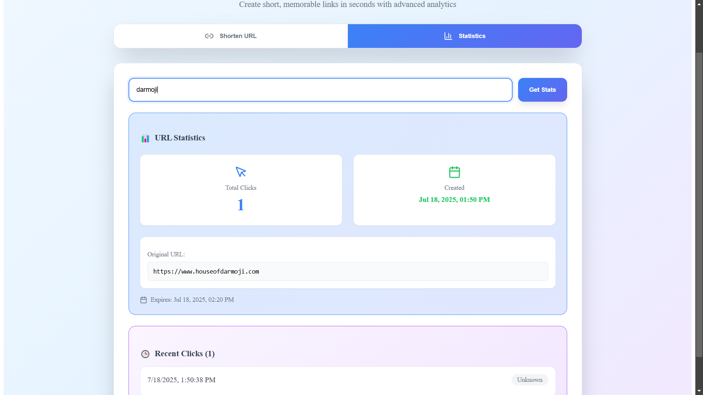

# URL Shortener Application
This repository contains a full-stack URL Shortener application with separate frontend and backend projects.

## Project Structure

```
22VE1A6612/
├── URL_Shortner_BE/        # Backend (Node.js, Express)
│   ├── index.js
│   └── package.json
├── URL_Shortner_FE/        # Frontend (React, Vite)
│   ├── src/
│   ├── public/
│   ├── index.html
│   ├── package.json
│   └── vite.config.js
├── package.json            # (optional, for monorepo setups)
└── README.md
```

---

## Backend (`URL_Shortner_BE`)
- **Tech Stack:** Node.js, Express
- **Entry Point:** `index.js`
- **Features:**
  - Accepts long URLs and returns shortened URLs
  - Redirects short URLs to the original long URLs

### Setup & Run Backend
```bash
cd URL_Shortner_BE
npm install
npm start
```

---

## Frontend (`URL_Shortner_FE`)
- **Tech Stack:** React, Vite
- **Entry Point:** `src/main.jsx`, `index.html`
- **Features:**
  - User interface to input long URLs
  - Displays shortened URLs
  - Handles redirection via short links

### Setup & Run Frontend
```bash
cd URL_Shortner_FE
npm install
npm run dev
```

The frontend will typically run on [http://localhost:5173](http://localhost:5173) (default Vite port).

---

## Usage
1. Start the backend server.
2. Start the frontend development server.
3. Open the frontend in your browser.
4. Enter a long URL to receive a shortened URL.
5. Use the short URL to be redirected to the original link.

---

## Folder Details
- `URL_Shortner_BE/`: Backend API and server logic
- `URL_Shortner_FE/`: Frontend React app (UI, API calls)

---

## License
This project is for educational purposes.


## Screenshots of the URL Shortener

### 📸 Screenshot 1
.png)

### 📸 Screenshot 2
.png)

### 📸 Screenshot 3
.png)

### 📸 Screenshot 4
.png)

### 📸 Screenshot 5

